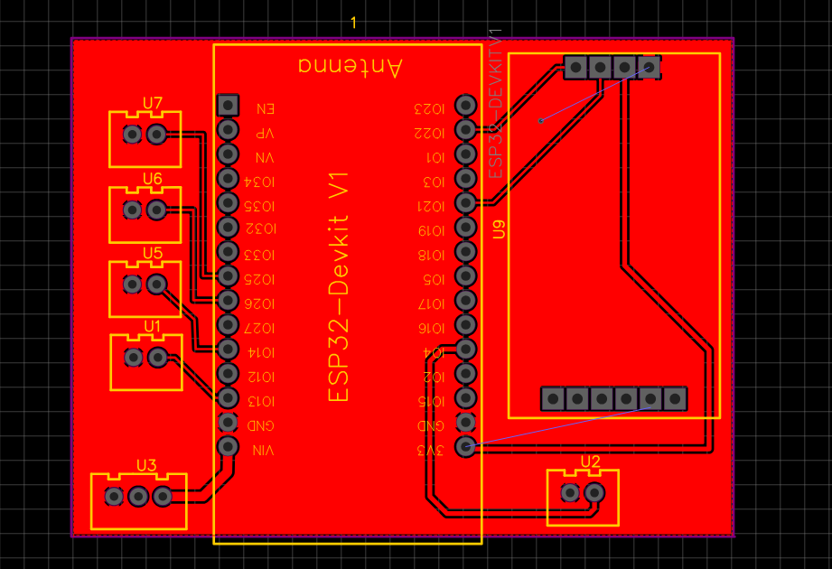
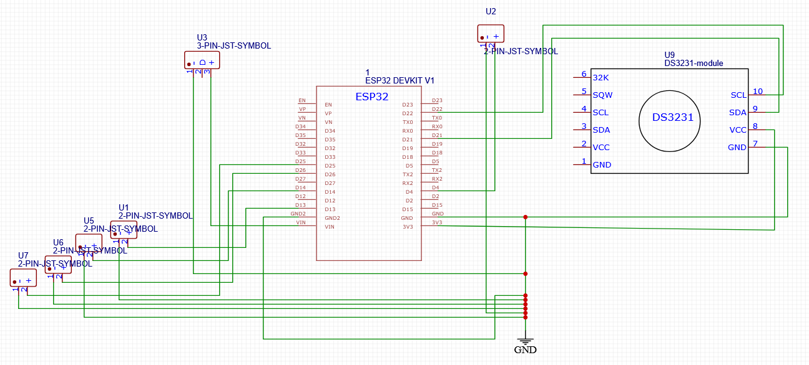

# Analog Clock with ESP32

This project is an analog clock application based on ESP32, using NeoPixel LEDs. The clock synchronizes time via NTP over WiFi, works redundantly with an RTC (DS3231), and can be managed remotely via a web interface. The LDR sensor automatically adjusts brightness according to ambient light. OTA (over-the-air update) support is included.

## Main Features
- Analog clock display with NeoPixel LEDs
- Automatic time sync via NTP over WiFi
- Redundant timekeeping with DS3231 RTC
- Automatic brightness control with LDR (day/night mode)
- Web interface for settings and control
- Wireless firmware update via OTA
- Alarm and various animation modes

## Folders
- `clock-esp32`: Basic clock application
- `clock-esp32-OTA`: OTA supported version
- `clock-ldr-OTA`: Advanced version with LDR and OTA
- `clock-webserver-OTA`: Web interface and OTA supported version
- `rtc-test`: RTC test code

## Hardware Requirements
- ESP32
- DS3231 RTC module
- 60 NeoPixel LED ring
- LDR (light sensor)
- Buttons

## Images

### PCB

### Clock

